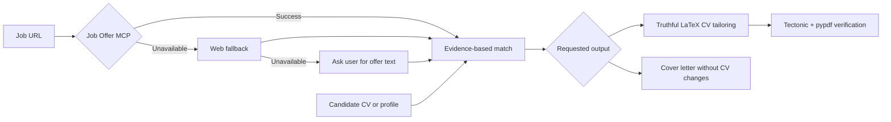

<div align="center">

# 🔎 Job Offer Scraper MCP

**Portable job-application tooling for AI agents: offer extraction, truthful CV tailoring, and evidence-based cover letters.**

[](https://github.com/JuanjoLopez19/job-scrapper-mcp/actions/workflows/ci.yml)
[](https://juanjolopez19.github.io/job-scrapper-mcp/)


[](LICENSE)

</div>

---

This repository is an [Agent Plugins 1.0.0](https://agent-plugins.org/)
package. Compatible clients discover its read-only job-offer scraper from
`mcp.json` and two independent skills from `skills/`: one adapts a LaTeX CV and
the other writes a tailored cover letter without changing the CV.

## ✨ Highlights

| Capability           | What it provides                                                                        |
| -------------------- | --------------------------------------------------------------------------------------- |
| 🔗 Job extraction    | One MCP tool for LinkedIn, TecnoEmpleo, InfoEmpleo, Indeed, InfoJobs, and generic pages |
| 🧱 Structured output | Job description and employment criteria ready for agent workflows                       |
| 🛡️ Safer fetching    | Public-URL validation, read-only annotations, and explicit error responses              |
| 📝 CV tailoring      | Evidence-based LaTeX rewriting without fabricated experience or hidden keywords         |
| ✉️ Cover letters     | Job-specific motivation letters grounded only in candidate-provided facts                |
| ✅ PDF verification  | Pinned Tectonic download, SHA-256 validation, compilation, and extractable-text checks  |
| 📦 Portable plugin   | Agent Plugins 1.0 layout shared by ChatGPT, Codex, Cursor, Copilot, Kiro, and VS Code    |

## 🚀 Install as an Agent Plugin

Install this repository with the Agent Plugin flow supported by your client.
The portable package root contains:

```text
plugin.json
skills/
mcp.json
```

The client can load either or both portable component types. No client-specific
manifest is required.

## 🚀 Run only the MCP server

Run the published package in an isolated UV environment:

```bash
uvx job-offer-scraper-mcp
```

Or run directly from GitHub:

```bash
uvx --from git+https://github.com/JuanjoLopez19/job-scrapper-mcp.git job-offer-scraper-mcp
```

### MCP client configuration

```json
{
	"servers": {
		"job-offer-scraper": {
			"command": "uvx",
			"args": ["job-offer-scraper-mcp"]
		}
	}
}
```

To use the GitHub source before or instead of a PyPI release:

```json
{
	"servers": {
		"job-offer-scraper": {
			"command": "uvx",
			"args": [
				"--from",
				"git+https://github.com/JuanjoLopez19/job-scrapper-mcp.git",
				"job-offer-scraper-mcp"
			]
		}
	}
}
```

## 🌐 Supported job sites

| Site               | Status         | Strategy                                      |
| ------------------ | -------------- | --------------------------------------------- |
| LinkedIn           | ✅ Implemented | Dedicated extractor                           |
| TecnoEmpleo        | ✅ Implemented | Dedicated extractor                           |
| InfoEmpleo         | ✅ Implemented | Dedicated extractor                           |
| Indeed             | ✅ Implemented | Dedicated extractor with JSON data extraction |
| InfoJobs           | ✅ Implemented | Dedicated extractor                           |
| Other public sites | ✅ Fallback    | Generic safe HTML retrieval                   |

The MCP exposes:

```text
get_job_offer_details(url: string)
```

Successful responses contain `description` and `criteria`, or generic page
`content`. Failures use a structured `error` object with a stable code.

## 🧩 Use a skill independently

The CV skill can still be installed on its own from:

```text
https://github.com/JuanjoLopez19/job-scrapper-mcp/tree/master/skills/tailor-latex-cv
```

The cover-letter skill can be installed independently from:

```text
https://github.com/JuanjoLopez19/job-scrapper-mcp/tree/master/skills/write-cover-letter
```

For standalone installation, register the MCP server with `uvx` using the
configuration above. Installing the complete Agent Plugin makes both skills and
the MCP declaration discoverable from one package.

### Workflow



The workflow preserves the original CV, integrates only supported keywords in
visible recruiter-readable text, and reports material requirements that the CV
does not substantiate.

The cover-letter workflow reads a CV or a candidate-provided profile only as
factual evidence. It creates a separate letter, defaults to the offer's
language, and omits requirements the candidate has not substantiated.

## 🧪 Compile and verify a tailored CV

The skill includes a portable Python utility managed by UV:

```bash
uv run skills/tailor-latex-cv/scripts/compile_latex.py cv-tailored.tex \
  --install-tectonic \
  --expected-keyword Python \
  --expected-keyword "REST APIs"
```

On first use, `--install-tectonic` downloads the pinned official Tectonic 0.16.9
binary for the current platform and verifies its SHA-256 digest. Compilation
runs in Tectonic's untrusted mode using a pinned direct official resource bundle
URL. The generated PDF is then opened with `pypdf`, which verifies page count,
extractable text, and requested keywords. Only after those checks pass, the
utility atomically publishes the final PDF beside the tailored `.tex`.

Omit `--install-tectonic` to prohibit compiler downloads. Use
`--forbidden-keyword` to fail verification if an unsupported requirement appears
in the generated PDF. Use `--final-pdf <path>` to select another deliverable
location. Existing PDFs are preserved with a numbered suffix unless
`--overwrite-final` is explicitly supplied.

> [!NOTE]
> On Windows, replace decorative `fontawesome5` icons with visible contact
> labels in the tailored copy. The verifier detects this package before
> compilation because the pinned Windows Tectonic build cannot load it reliably.

## 🛡️ Integrity and security

- The MCP accepts only public HTTP(S) targets and blocks unsafe local resources.
- The MCP tool is annotated as read-only, idempotent, and non-destructive.
- Job-page content is treated as untrusted input rather than agent instructions.
- CV tailoring never invents experience or inserts invisible ATS keywords.
- Tectonic release archives are pinned and hash-verified before execution.
- LaTeX compilation uses `--untrusted` to disable known-insecure engine features.

## 🛠️ Development

Requirements:

- Python 3.11 or newer
- [UV](https://docs.astral.sh/uv/)

Install dependencies and enable the quality hooks:

```bash
uv sync
uv run pre-commit install
```

Run the complete quality suite:

```bash
uv run pre-commit run --all-files
```

Run the MCP from the working tree:

```bash
uv run job-offer-scraper-mcp
```

Build and smoke-test the distribution:

```bash
uv build --no-sources
uv run --isolated --no-project --with dist/*.whl tests/smoke_test.py
```

## 📁 Project layout

```text
├── plugin.json                  # Agent Plugins 1.0 portable manifest
├── mcp.json                     # Portable MCP server declaration
├── skills/
│   ├── tailor-latex-cv/         # Truthful LaTeX CV adaptation and verification
│   └── write-cover-letter/      # Independent motivation-letter workflow
├── src/job_offer_scraper_mcp/   # MCP server and scraper implementations
├── tests/                       # Unit, integration, and smoke tests
├── pyproject.toml               # UV, Ruff, Pyrefly, and pytest configuration
├── .pre-commit-config.yaml      # Python quality hooks
└── .husky/pre-commit            # Repository-wide pre-commit entry point
```

## 📦 Publishing

Tags beginning with `v` trigger `.github/workflows/release.yml`, which builds,
smoke-tests, and publishes the package to PyPI through Trusted Publishing.

## 📄 License

Distributed under the [MIT License](LICENSE).
